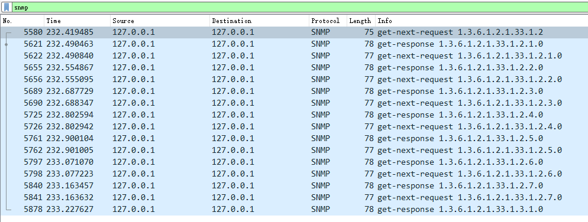

# SNMP协议梳理

## 1.SNMP基本知识介绍


- **什么是SNMP**？

  **简单网络管理协议**（SNMP）是一个[互联网标准](https://en.wikipedia.org/wiki/Internet_Standard)协议，用于收集和组织有关[IP](https://en.wikipedia.org/wiki/Internet_Protocol)网络上管理设备的信息，并修改该信息以更改设备行为。通常支持 SNMP 的设备包括电缆调制解调器、路由器、交换机、服务器、工作站、打印机等。 

  

  SNMP使用UDP协议作为传输层协议，UDP是无连接的协议。在运输层使用的是UDP协议，主要是考虑到TCP对系统开销较大，不利于网络管理环境的要求。虽然UDP数据包的传输不可靠，但UDP非常高效，在网络繁忙时照样可以正常工作，当然UDP也有一些不足，如Trap告警有可能无法按时发送到管理进程。

  

  SNMP广泛应用于[网络管理](https://en.wikipedia.org/wiki/Network_management)，用于[网络监控](https://en.wikipedia.org/wiki/Network_monitoring)。SNMP 以变量的形式公开管理数据，这些变量位于[管理信息库](https://en.wikipedia.org/wiki/Management_information_base)（MIB） 中，其中描述了系统状态和配置。然后，可以通过管理应用程序远程查询（在某些情况下，还可以操作这些变量）。

  

  

- 通信架构

  SNMP协议采用C/S架构，定义了三种角色：SNMP管理，SNMP代理agent和代理proxy服务器。SNMP管理作为客户端，agent和proxy作为服务端。

  由NMS 管理站(通常称为客户端)对Agent和Proxy代理服务器发起请求,对于某些不支持网络或者不是IP网络的设备。如果要通过SNMP协议进行管理的话则需要通过Proxy代理服务器实现协议的转换。

  Agent和Proxy作为服务端工作在161端口，NMS在某些情况下需要监听162端口接收来自Agent和Proxy的Trap告警。


```mermaid
graph TD
	NMS(NMS 管理站 监听162端口)-- 获取数据 -->Agent(AGENT 代理)
	NMS-- 获取数据 -->Proxy(Proxy 代理服务器)
	Proxy-- 协议转换 -->Device(不支持网络的设备)
	Proxy-- 协议转换 -->NOIP(非IP网络)
	Proxy-- Trap上报 -->NMS
	Agent-- Trap上报 -->NMS
```

## 2.SNMP系统组成

一套完整的SNMP系统主要包括管理信息库（MIB）、管理信息结构（SMI）及SNMP报文协议。

如果要知道一个类似 **.1.3.6.1.2.1.33.1.2** 这样的OID代表什么意思，那么就必须得知道它的MIB。什么是MIB?

- 管理信息库MIB

  SNMP管理和Agent的沟通桥梁。MIB是资源和对象标识符oid（object identifier）之间唯一对应关系的数据库。任何一个被管理的资源都可以用oid来对应。每个SNMP设备（Agent）都有自己的MIB，SNMP Agent必须查询MIB库，才能识别SNMP管理的请求。

  

iso.org.dod.internet.mgmt.mib.ip.ipInReceives对应的数字表示为：1.3.6.1.2.1.4.3。比如，设置或获取系统正确运行时间的oid为1.3.6.1.2.1.1.3

``` mermaid
graph TD
root("ROOT")
root-->ccit(ccit <0>)
root-->iso(iso <1>)
root-->joint(joint-iso-ccit <2>)
iso-->org(org <3>)
org-->dod(dod <6>)
dod-->internet(internet <1>)
internet-->directory(directory <1>)
internet-->mgmt(mgmt <2>)
internet-->experimental(experimental <3>)
internet-->private(private <4>)
mgmt-->mib-2(mib-2 <1>)
private-->enterprise(enterprise <1>)
mib-2-->system(system <1>)
mib-2-->interface(interface <2>)
mib-2-->at(at <3>)
mib-2-->ip(ip <4>)
mib-2-->icmp(icmp <5>)
mib-2-->tcp(tcp <6>)
mib-2-->udp(udp <7>)
mib-2-->more(...)
mib-2-->upsMib(upsMib <33>)
```


## 3.SNMP三个版本的区别

- V1

  SNMPv1是SNMP协议的最初版本，提供最小限度的网络管理功能。SNMPv1的SMI和MIB都比较简单，且存在较多安全缺陷。

  SNMPv1采用团体名认证。团体名的作用类似于密码，用来限制NMS对Agent的访问。如果SNMP报文携带的团体名没有得到NMS/Agent的认可，该报文将被丢弃。

  

  v1支持的PDU（协议数据单元）

  ---

  - [x] GET REQUEST

    SNMP 管理站用Get-Request消息从拥有SNMP代理的网络设备中检索信息，而SNMP代理则用Get-Response消息响应。Get-Next- Request用于和Get-Request组合起来查询特定的表对象中的列元素。

    ```go
    oids:=[]string{
    		".1.3.6.1.2.1.33.1.4.1.0",
    		".1.3.6.1.2.1.33.1.4.2.0",
    	}
    ```

    Get返回的将是如下的结果:

    > name:.1.3.6.1.2.1.33.1.4.1.0 value:6 type:Integer 
    >
    > ---
    >
    > name:.1.3.6.1.2.1.33.1.4.2.0 value:1 type:Integer

    

  - [x] GET NEXT REQUEST

    SNMP管理站获取当前查询的OID的下一个OID的值

    > GetNext返回的结果
    >
    > name:.1.3.6.1.2.1.33.1.4.2.0 value:1 type:Integer
    >
    > ---
    >
    > name:.1.3.6.1.2.1.33.1.4.3.0 value:1 type:Integer

  - [x] GET RESPONSE

  - [x] SET REQUEST

    SNMP管理站用Set-Request 可以对网络设备进行远程配置（包括设备名、设备属性、删除设备或使某一个设备属性有效/无效等）。

  - [x] TRAP 

    SNMP代理使用Trap向SNMP管理站发送非请求消息，一般用于描述某一事件的发生，如接口UP/DOWN，IP地址更改等。

    上面五种消息中Get-Request、Get-Next-Request和Set-Request是由管理站发送到代理侧的161端口的；后面两种Get-Response和Trap 是由代理进程发给管理进程的，其中Trap消息被发送到管理进程的162端口。

    

  **WALK是什么原理?** 



>  walk是通过一个rootOid 开始不断的使用GETNEXT REQUEST直到到达叶子节点，没有更多子节点后把每个GETNEXT REQUEST的返回组合到一起返回给我们的。

- V2C

  SNMP第二版修订了第一版并且包含了在性能、安全、机密性和管理者之间通信这些领域的改进。它引入了GETBULK以取代反复的GETNEXT，藉以在单个请求中获取大量的管理数据。然而，SNMP第二版的新安全系统被认为过于复杂，而不被广泛接受。

  SNMP v2c（基于社区的SNMP第二版）SNMPv2c包含SNMP第二版除了受争议的新SNMP第二版安全模型以外的部分，并以SNMP第一版的简单的基于社区的安全性方案取而代之。

  SNMPv2c也采用团体名认证。在兼容SNMPv1的同时又扩充了SNMPv1的功能：它提供了更多的操作类型（GetBulk和inform操作）；支持更多的数据类型（Counter32等）；提供了更丰富的错误代码，能够更细致地区分错误。

  在v1版本中只有数据类型的错误码，而v2c版本中增加了不少。

  | 差错状态 | 名字       | 说明                                     |
  | -------- | ---------- | ---------------------------------------- |
  | 0        | noError    | 一切正常                                 |
  | 1        | tooBig     | 报文太大，代理无法将报文装入一个SNMP包中 |
  | 2        | noSuchName | 不存在的Oid                              |
  | 3        | badValue   | setPDU设置了一个非法值                   |
  | 4        | readOnly   | 管理者试图修改一个只读变量               |
  | 5        | genErr     | 其它的错误                               |

  在V1的基础上同时添加了两个PDU

  ---

  - [x] GETBULK REQUEST

  - [x] INFORM

    

  相比较SNMPv1而言，SNMPv2c新增了GetBulk操作报文和inform操作报文。GetBulk操作所对应的基本操作类型是GetNext操作，通过对Non repeaters和Max repetitions参数的设定，高效率地从Agent获取大量管理对象数据。而inform操作也就是相当于Trap的升级操作，但是二者又有什么不同之处呢？Trap报文发出去之后不会收到响应报文，而inform报文在发出报文之后能收到响应报文。

  

- V3

  SNMPv3主要在安全性方面进行了增强，它采用了USM和VACM技术。USM提供了认证和加密功能，VACM确定用户是否允许访问特定的MIB对象以及访问方式。

  

  - USM（基于用户的安全模型）

  USM引入了用户名和组的概念，可以设置认证和加密功能。认证用于验证报文发送方的合法性，避免非法用户的访问；加密则是对NMS和Agent之间传输的报文进行加密，以免被窃听。通过有无认证和有无加密等功能组合，可以为NMS和Agent之间的通信提供更高的安全性。

  

  - VACM（基于视图的访问控制模型）

  VACM技术定义了组、安全等级、上下文、MIB视图、访问策略五个元素，这些元素同时决定用户是否具有访问的权限，只有具有了访问权限的用户才能管理操作对象。在同一个SNMP实体上可以定义不同的组，组与MIB视图绑定，组内又可以定义多个用户。当使用某个用户名进行访问的时候，只能访问对应的MIB视图定义的对象。 

  